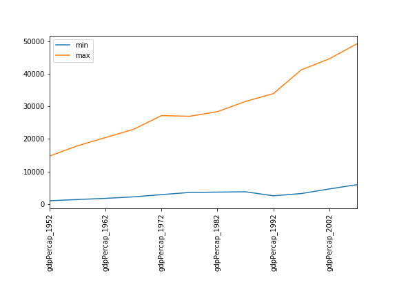

## `matplotlib` is the most widely used scientific plotting library in Python.

*   Commonly use a sub-library called `matplotlib.pyplot`.
*   The Jupyter Notebook will render plots inline if we ask it to using a "magic" command.

~~~
%matplotlib inline
import matplotlib.pyplot as plt
~~~
{: .python}

*   Simple plots are then (fairly) simple to create.

~~~
x = [1, 2, 3, 4, 5]
y = [2, 4, 6, 8, 10]

plt.plot(x, y)
plt.xlabel('Numbers')
plt.ylabel('Doubles')
~~~
{: .python}

## Plot data directly from a Pandas dataframe.

*   We can also plot Pandas dataframes.
*   This implicitly uses `matplotlib.pyplot`.

~~~
import pandas

data = pandas.read_csv('data/gapminder_gdp_oceania.csv', index_col='country')
data.ix['Australia'].plot()
plt.xticks(rotation=90)
~~~
{: .python}

## Select and transform data, then plot it.

*   By default, `DataFrame.plot` plots with the rows as the X axis.
*   We can transpose the data in order to plot multiple series.

~~~
data.T.plot()
plt.ylabel('GDP per capita')
plt.xticks(rotation=90)
~~~
{: .python}

## Many styles of plot are available.

*   For example, do a bar plot using a fancier style.

~~~
plt.style.use('ggplot')
data.T.plot(kind='bar')
plt.xticks(rotation=90)
plt.ylabel('GDP per capita')
~~~
{: .python}

*   Extract years from the last four characters of the columns' names.
    *   Store these in a list using the Accumulator pattern.
*   Can also convert dataframe data to a list.

~~~
# Accumulator pattern to collect years (as character strings).
years = []
for col in data.columns:
    year = col[-4:]
    years.append(year)

# Australia data as list.
gdp_australia = data.ix['Australia'].tolist()

# Plot: 'b-' sets the line style.
plt.plot(years, gdp_australia, 'b-')
~~~
{: .python}

## Can plot many sets of data together.

~~~
# Accumulator pattern to collect years (as character strings).
years = []
for col in data.columns:
    year = col[-4:]
    years.append(year)

# Select two countries' worth of data.
gdp_australia = data.ix['Australia']
gdp_nz = data.ix['New Zealand']

# Plot with differently-colored markers.
plt.plot(years, gdp_australia, 'b-', label='Australia')
plt.plot(years, gdp_nz, 'g-', label='New Zealand')

# Create legend.
plt.legend(loc='upper left')
plt.xlabel('Year')
plt.ylabel('GDP per capita ($)')
~~~
{: .python}

*   Plot a scatter plot correlating the GDP of Australia and New Zealand
*   Use either `plt.scatter` or `DataFrame.plot.scatter`

~~~
plt.scatter(gdp_australia, gdp_nz)
~~~
{: .python}

~~~
data.T.plot.scatter(x = 'Australia', y = 'New Zealand')
~~~
{: .python}

> ## Minima and Maxima
>
> Fill in the blanks below to plot the minimum GDP per capita over time
> for all the countries in Europe.
> Modify it again to plot the maximum GDP per capita over time for Europe.
>
> ~~~
> data_europe = pandas.read_csv('data/gapminder_gdp_europe.csv', index_col='country')
> data_europe.____.plot(label='min')
> data_europe.____
> plt.legend(loc='best')
> plt.xticks(rotation=90)
> ~~~
> {: .python}
>
> > ## Solution
> > 
> > ~~~
> > data_europe = pandas.read_csv('gapminder_gdp_europe.csv', index_col='country')
> > data_europe.min().plot(label='min')
> > data_europe.max().plot(label='max')
> > plt.legend(loc='best')
> > plt.xticks(rotation=90)
> > ~~~
> > {: .python}
> > 
> {: .solution}
{: .challenge}

> ## Correlations
>
> Modify the example in the notes to create a scatter plot showing
> the relationship between the minimum and maximum GDP per capita
> among the countries in Asia for each year in the data set.
> What relationship do you see (if any)?
>
> ~~~
> data_asia = pandas.read_csv('gapminder_gdp_asia.csv', index_col='country')
> data_asia.describe().T.plot(kind='scatter', x='min', y='max')
> ~~~
> {: .python}
>
> > ## Solution
> >
> > 
> > 
> > No particular correlations can be seen between the minimum and maximum gdp values
> > year on year. It seems the fortunes of asian countries do not rise and fall together. 
> > 
> {: .solution}
>
> You might note that the variability in the maximum is much higher than
> that of the minimum.  Take a look at the maximum and the max indexes:
>
> ~~~
> data_asia = pandas.read_csv('gapminder_gdp_asia.csv', index_col='country')
> data_asia.max().plot()
> print(data_asia.idxmax())
> print(data_asia.idxmin())
> ~~~
> {: .python}
> > ## Solution
> > 
> > 
> > Seems the variability in this value is due to a sharp drop after 1972.
> > Some geopolitics at play perhaps? Given the dominance of oil producing countries, 
> > maybe the Brent crude index would make an interesting comparison?
> > Whilst Myanmar consistently has the lowest gdp, the highest gdb nation has varied
> > more notably.
> > 
> {: .solution}
{: .challenge}

> ## More Correlations
>
> This short programs creates a plot showing
> the correlation between GDP and life expectancy for 2007,
> normalizing marker size by population:
>
> ~~~
> data_all = pandas.read_csv('gapminder_all.csv', index_col='country')
> data_all.plot(kind='scatter', x='gdpPercap_2007', y='lifeExp_2007',
>               s=data_all['pop_2007']/1e6)
> ~~~
> {: .python}
>
> Using online help and other resources,
> explain what each argument to `plot` does.
>
> > ## Solution
> > 
> >
> > A good place to look is the documentation for the plot function -
> > help(data_all.plot).
> >
> > kind - As seen already this determines the kind of plot to be drawn.
> >
> > x and y - A column name or index that determines what data will be
> > placed on the x and y axes of the plot
> >
> > s - Details for this can be found in the documentation of plt.scatter.
> > A single number or one value for each data point. Determines the size
> > of the plotted points.
> > 
> {: .solution}
{: .challenge}
